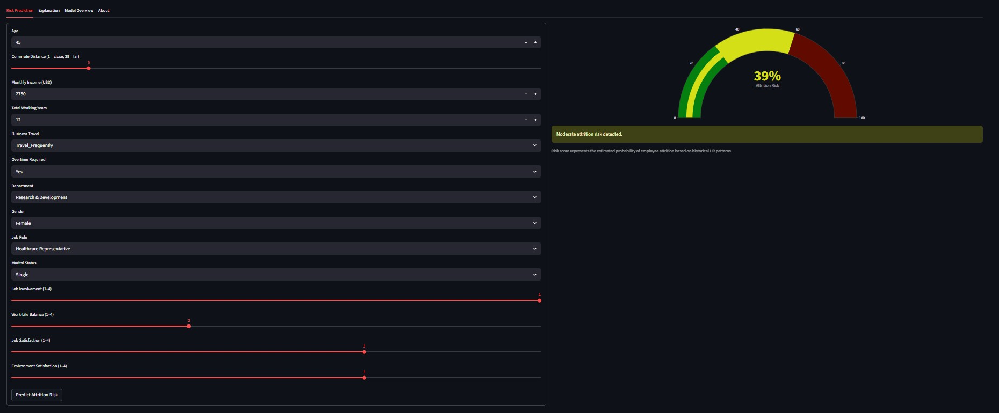
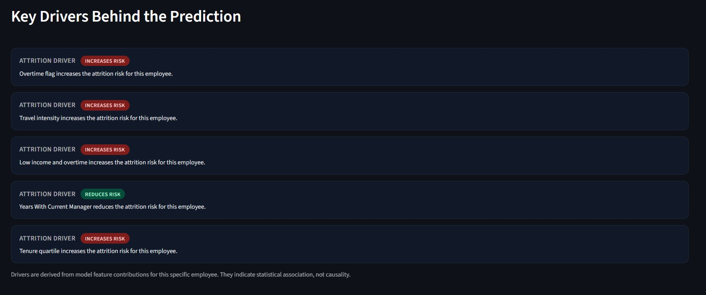
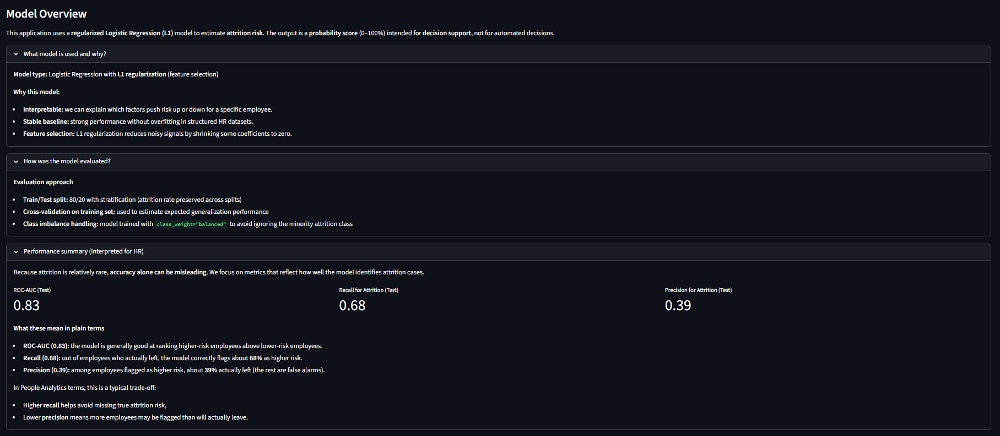
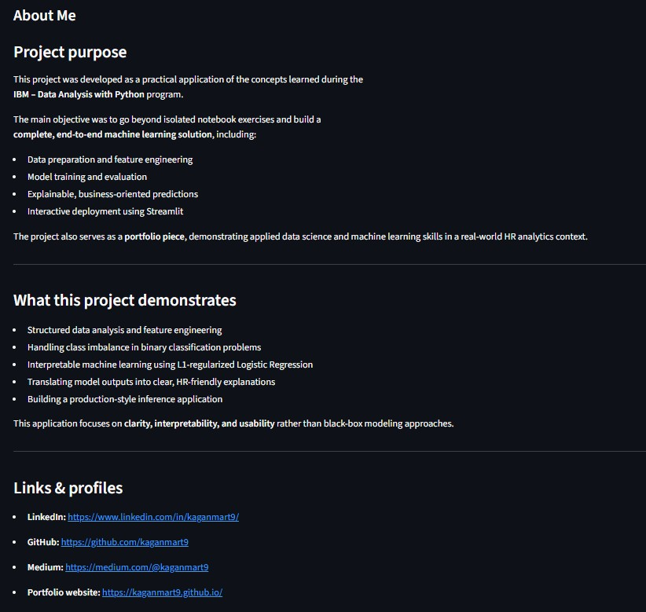

# Employee Attrition Risk Predictor

This project demonstrates an end-to-end, explainable machine learning solution for predicting employee attrition risk using structured HR data.

It was developed as a practical application of skills learned during the **IBM Data Analysis with Python** certification.

The project intentionally prioritizes **interpretability**, **business usability**, and **clean deployment** over black-box complexity.

## 1. Project Overview

### The Problem

Employee attrition (turnover) is a costly problem for organizations. Losing key talent disrupts operations, incurs recruitment costs, and lowers morale. However, predicting who will leave is difficult because the reasons are often multifaceted, involving compensation, role satisfaction, work-life balance, and more.

### The Solution

This application provides a **Decision Support System** for HR professionals and managers. Instead of automating hiring/firing decisions, it offers:

1. **Risk Quantification:** A probabilistic score (0-100%) indicating the likelihood of an employee leaving.
2. **Explainable Insights:** Specific "key drivers" for each prediction, helping stakeholders understand *why* a specific employee is at risk.

**Note:** This tool supports decision-making; it does not replace human judgment.

## 2. Live Application

The application is deployed on Streamlit Cloud and is publicly accessible:

**[Open Employee Attrition Risk Predictor](https://kaganmart9-attrition-risk.streamlit.app/)**

**Key Features:**

* **Interactive Interface:** Adjust employee parameters (age, income, distance, etc.) to see real-time risk updates.
* **Bilingual Support:** Full support for both **English** and **Turkish** languages.
* **Visual Explanations:** Dynamic gauges and driver cards to visualize risk factors.

## 3. Application Screenshots

### Risk Prediction Interface



### Key Drivers (Explainability)



### Model Performance Overview



### About Page



## 4. Data & Problem Framing

The project uses a structured **HR Employee Attrition** dataset. This is historical, observational data containing labeled records of employees who have either stayed or left the company.

**Key Feature Groups:**

* **Demographics:** Age, Gender, Marital Status.
* **Job Role:** Department, Job Role, Job Level.
* **Compensation:** Monthly Income, Percent Salary Hike, Stock Option Level.
* **Satisfaction:** Job Satisfaction, Environment Satisfaction, Relationship Satisfaction.
* **Work Context:** Overtime, Business Travel, Distance From Home.

The goal is **Binary Classification**:

* `0`: Employee stays.
* `1`: Employee leaves (Attrition).

## 5. Modeling Approach

We prioritized **transparency** and **stability** over raw predictive power.

### Selected Model: Logistic Regression (L1 Lasso)

* **Why Logistic Regression?** It provides calibrated probabilities (risk scores) rather than just hard labels.
* **Why L1 Regularization?** L1 (Lasso) performs automatic feature selection by shrinking coefficients of irrelevant features to zero. This reduces noise and results in a concise list of impactful drivers.
* **Scikit-Learn Pipeline:** The model is wrapped in a `Pipeline` that handles scaling (StandardScaler) and encoding (OneHotEncoder) automatically to prevent data leakage.

## 6. Model Evaluation (HR-Friendly)

Evaluation focused on the **minority class (Attrition)** because predicting who stays (the majority) is trivial but unhelpful. We used a stratified train/test split (80/20) and handled class imbalance using `class_weight="balanced"`.

**Performance Metrics (Test Set):**

| Metric | Value | Interpretation |
| :--- | :--- | :--- |
| **ROC-AUC** | **0.83** | The model is strong at ranking high-risk employees above low-risk ones. |
| **Recall (Attrition)** | **0.68** | The model correctly identifies ~68% of the employees who actually left. |
| **Precision (Attrition)** | **0.39** | When the model flags high risk, it is correct ~39% of the time. |

**The Trade-off:**
In People Analytics, **Recall** is often prioritized. We prefer to flag more employees (some false alarms) rather than miss a critical employee who is about to leave. Users can interpret the risk score to make their own final judgment.

## 7. Explainability Layer

To build trust with stakeholders, every prediction is accompanied by an explanation.

* **Global Feature Importance:** Derived from the model coefficients (L1 weights).
* **Local Explanations:** Calculated by multiplying the specific employee's feature value by the corresponding coefficient.
  * *Positive Contribution* -> Increases Risk (e.g., "Frequent Travel", "Low Satisfaction")
  * *Negative Contribution* -> Reduces Risk (e.g., "High Income", "Long Tenure")

**Important:** These drivers indicate statistical **association**, not necessarily **causation**.

## 8. Code Structure

```text
.
├── app.py                      # Main Streamlit application entry point
├── requirements.txt            # Python dependencies for reproducibility
├── data
│   ├── raw                     # Original immutable CSV dataset
│   ├── interim                 # Intermediate data after audit/cleaning
│   └── processed               # Final feature-engineered dataset for modeling
├── figures                     # Images and screenshots for documentation
├── models                      # Serialized model pipelines (.joblib) and configs
├── notebooks
│   ├── 01_data_audit.ipynb     # Initial data quality checks
│   ├── 02_eda.ipynb            # Exploratory Data Analysis & Visualization
│   ├── 03_feature_engineering.ipynb # Prototyping features and transformations
│   └── 04_modeling.ipynb       # Model training, tuning, and evaluation
└── src
    ├── data_loader.py          # Utilities for loading raw data
    ├── explanation.py          # Logic for generating human-readable explanations
    ├── feature_engineering.py  # Transformations (bins, flags, interactions)
    ├── inference.py            # Wrapper for making predictions
    ├── modeling.py             # Model definitions and training routines
    └── preprocessing.py        # Scikit-learn column transformers
```

## 9. Example Code Snippets

**Feature Engineering (Quartile Inference)**
We use stable bin edges for inference to ensure single-row predictions work correctly.

```python
# src/feature_engineering.py
def _safe_quartile_inference(series: pd.Series, edges: list[float]) -> pd.Series:
    """
    Assign quartile bucket (0-3) using fixed bin edges for inference.
    This avoids pd.qcut instability for single-row inputs.
    """
    bins = [-np.inf] + edges + [np.inf]
    out = pd.cut(series, bins=bins, labels=[0, 1, 2, 3], include_lowest=True)
    return out.astype("float").fillna(0).astype(int)
```

**Model Pipeline Construction**
A scikit-learn pipeline ensures all preprocessing steps are locked to the model.

```python
# src/modeling.py
def build_pipeline(preprocessor, model_type: ModelType) -> Pipeline:
    model = LogisticRegression(
        max_iter=1000,
        class_weight="balanced",
        solver="saga",
        penalty="l1",  # Feature selection
        random_state=42,
    )
    return Pipeline(steps=[("preprocessing", preprocessor), ("model", model)])
```

**Generating Explanations**
We map raw feature contributions to human-readable text.

```python
# src/explanation.py
def generate_explanations(df, top_n=5, lang="English"):
    # ... (sorting logic)
    for _, row in df_sorted.iterrows():
        if row["contribution"] > 0:
            suffix = "increases the attrition risk."
        else:
            suffix = "reduces the attrition risk."

        text = f"{clean_feature_name} {suffix}"
        explanations.append({"text": text, "direction": direction})
    return explanations
```

## 10. Deployment

The project is designed for **reproducibility** and **easy deployment**:

1. **Environment:** Dependencies are strictly managed in `requirements.txt`.
2. **Model Serialization:** The trained pipeline is saved as `models/logreg_l1_pipeline.joblib`.
3. **Streamlit Cloud:** The `app.py` script is detected automatically by Streamlit Cloud, launching the web interface without complex server configuration.

## 11. About the Author

### Ali Kagan Mart

This project was built to demonstrate a complete data science workflow—from raw data to a deployed product. It reflects a "learning-by-building" philosophy, applying advanced concepts from the **IBM Data Analysis with Python** certification to a real-world scenario.

* **LinkedIn:** [kaganmart9](https://www.linkedin.com/in/kaganmart9/)
* **GitHub:** [kaganmart9](https://github.com/kaganmart9)
* **Medium:** [@kaganmart9](https://medium.com/@kaganmart9)
* **Portfolio:** [kaganmart9.github.io](https://kaganmart9.github.io/)

## 12. Disclaimer

This application is for **educational and portfolio purposes only**. The risk scores and drivers are based on historical patterns and statistical associations. They do not prove causality. This tool should not be used as the sole basis for hiring, firing, or promotion decisions.
